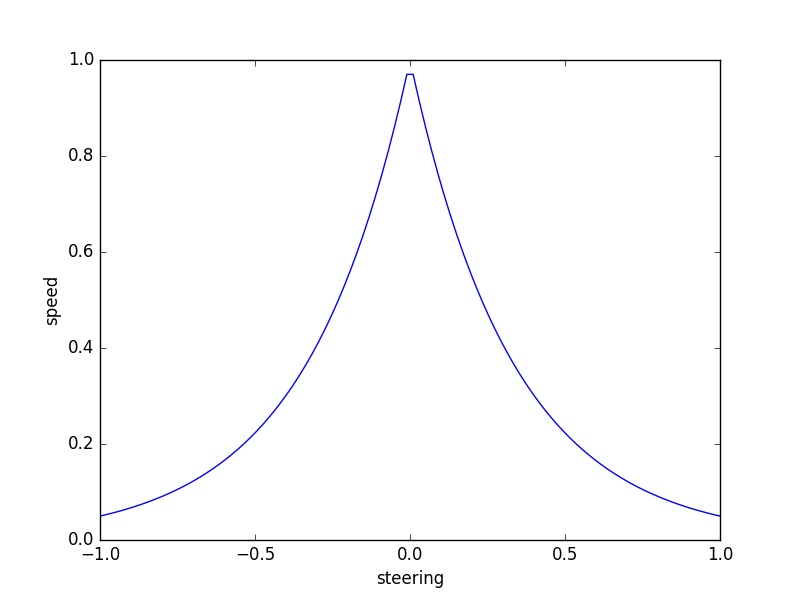

# PID controller
In this project , a PID controller is implemented in C++ to maneuver the vehicle around a track.  
This project is done as part of Self-Driving Car Engineer Nanodegree Program.


---

## Dependencies

* cmake >= 3.5
 * All OSes: [click here for installation instructions](https://cmake.org/install/)
* make >= 4.1(mac, linux), 3.81(Windows)
  * Linux: make is installed by default on most Linux distros
  * Mac: [install Xcode command line tools to get make](https://developer.apple.com/xcode/features/)
  * Windows: [Click here for installation instructions](http://gnuwin32.sourceforge.net/packages/make.htm)
* gcc/g++ >= 5.4
  * Linux: gcc / g++ is installed by default on most Linux distros
  * Mac: same deal as make - [install Xcode command line tools]((https://developer.apple.com/xcode/features/)
  * Windows: recommend using [MinGW](http://www.mingw.org/)
* [uWebSockets](https://github.com/uWebSockets/uWebSockets)
  * Run either `./install-mac.sh` or `./install-ubuntu.sh`.
  * If you install from source, checkout to commit `e94b6e1`, i.e.
    ```
    git clone https://github.com/uWebSockets/uWebSockets 
    cd uWebSockets
    git checkout e94b6e1
    ```
    Some function signatures have changed in v0.14.x. See [this PR](https://github.com/udacity/CarND-MPC-Project/pull/3) for more details.
* This project involves the Term 2 Simulator which can be downloaded [here](https://github.com/udacity/self-driving-car-sim/releases)    
  
Fellow students have put together a guide to Windows set-up for the project [here](https://s3-us-west-1.amazonaws.com/udacity-selfdrivingcar/files/Kidnapped_Vehicle_Windows_Setup.pdf) if the environment you have set up for the Sensor Fusion projects does not work for this project. There's also an experimental patch for windows in this [PR](https://github.com/udacity/CarND-PID-Control-Project/pull/3).

---

## Running the Code
Once the install for uWebSocketIO is complete, the main program can be built and run by doing the following from the project top directory.

1. Make a build directory : `mkdir build && cd build`
2. Compile : `cmake .. && make`
3. Run it : `./pid`

Alternatively some scripts have been included to streamline this process, these can be leveraged by executing the following in the top directory of the project:

1. `./clean.sh`
2. `./build.sh`
3. `./run.sh`

---

## Reflection

> PID controller :  
>>A proportional–integral–derivative controller is a control loop feedback mechanism widely used in industrial control systems and a variety of other applications requiring continuously modulated control. A PID controller continuously calculates an error value as the difference between a desired setpoint (SP) and a measured process variable (PV) and applies a correction based on proportional, integral, and derivative terms (denoted P, I, and D respectively) which give the controller its name.


There are different approaches to tune the PID controller gains Kp , Ki , Kd such as manual tuning , stochastic gradient descent and twiddle algorithms. I decided to go with the manual tuning following the tuning rules found in this [post](https://robotics.stackexchange.com/questions/167/what-are-good-strategies-for-tuning-pid-loops). 

>1. Set all gains to zero.
>2. Increase the P gain until the response to a disturbance is steady oscillation.
>3. Increase the D gain until the the oscillations go away (i.e. it's critically damped).
>4. Repeat steps 2 and 3 until increasing the D gain does not stop the oscillations.
>5. Set P and D to the last stable values.
>6. Increase the I gain until it brings you to the setpoint with the number of oscillations desired.

### P component

It's is proportional to the cross track error. It has direct impact on the trajectory because the control action makes the vehicle correct its direction in proportion to the error.If the proportional gain `Kp` is high enough , the vehicle will overshoot and the larger the values of `Kp` , the faster are the oscillations and this causes the vehicle to swivel hard left and right around the target trajectory.

#### The effect of P controller can be watched [here](https://www.youtube.com/watch?v=4Zn5lMgn2UU)
 
### D component

It helps in damping the oscillations by introducing the D component which is proportional to the derivative of the error over time. When the vehicle has turned enough to reduce the error , the D component will sense that the error has been reduced and this causes the controller to apply a counter steering in order to converge to the target trajectory.

#### The effect of PD  controller can be watched [here](https://www.youtube.com/watch?v=LYhUnZ8xbVU)

### I component

It's proportional to the sum of the previous cross track errors over time.It's used to eliminate the systematic biases such as steering drift and reduce the steady-state error.

#### The effect of PID controller can be watched [here](https://www.youtube.com/watch?v=_DAz7sskXm4)

---

## PID tuning

I started with the initial values
```
Kp = 0.2 
Ki = 0
Kd = 0
```
and I realized the vehicle was oscillating around the trajectory so I gradually increased `Kd` as it helps reduce the oscillations.
```
Kp = 0.2 
Ki = 0
Kd = 1.0

```
I started to increase `Ki` a little bit as it helps reduce the steady state error on the long run and after some iterations , I was able to get good results with the following control gain values.
```
Kp = 0.2
Ki = 0.0001 
Kd = 2.5
```
In order to improve the vehicle maneuvering at sharp turns , I implemented a PID controller for throttle to control the vehicle speed by lowering the speed at sharp turns so that steering PID controller can apply the sufficient steering that corrects the vehicle trajectory and increasing the speed when the road is straight similar to what happens in the real world case.
   
 The setpoint , reference or desired , speed is calculated as a exponential function of the the steering value so when the steering value goes high in either direction at sharp turns , the vehicle speed decreases.

 

Then the speed error which is the difference between the reference speed and actual speed measured by the vehicle sensors and returned back by the simulator , is injected to the PID controller to obtain the throttle value needed to reach this reference speed.

 ```
ref_speed = exp(-3*fabs(steer_value));
speed_error = ref_speed - (speed/100);
pid_throttle.UpdateError(speed_error);
throttle_value = pid_throttle.TotalError();  
```

